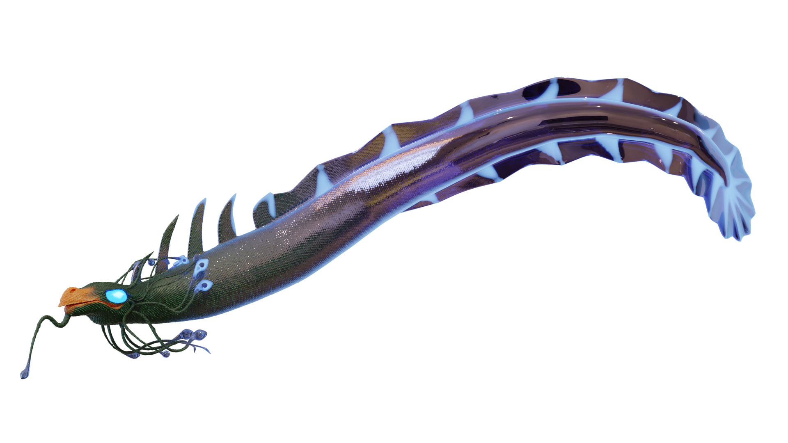

This project was an entry to a 3d Collabetition held by Billelis. It was completed in 3 weeks and underwent multiple design changes.

Areas of learning:
  - Shading and textures
  - Particle generation for the moss
  - Asset design and rigging for the wrym
  - Cloth simulation for the roses
