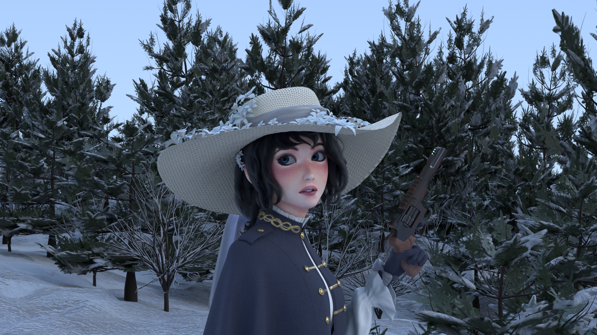
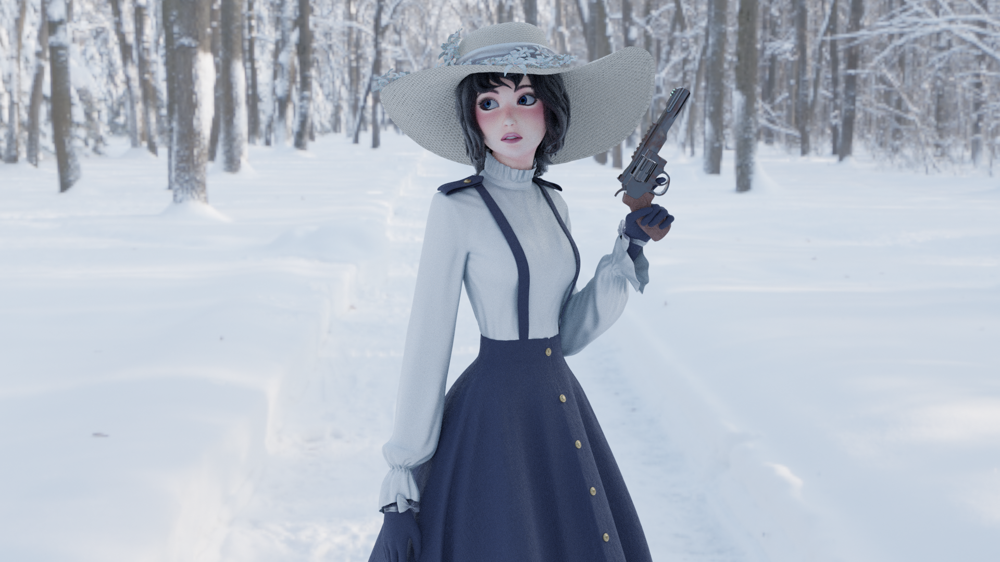

This project took 1 month.

Areas of learning:
  - Character sculpting, retopology and rigging
  - Particle simulation for the hair
  - Shading and texturing for the skintone and hair
  - Cloth simulation and sculpting for the clothes
  - Landscape creation and particle simulation for the environment
  - General asset design for the gun, shoes etc.
