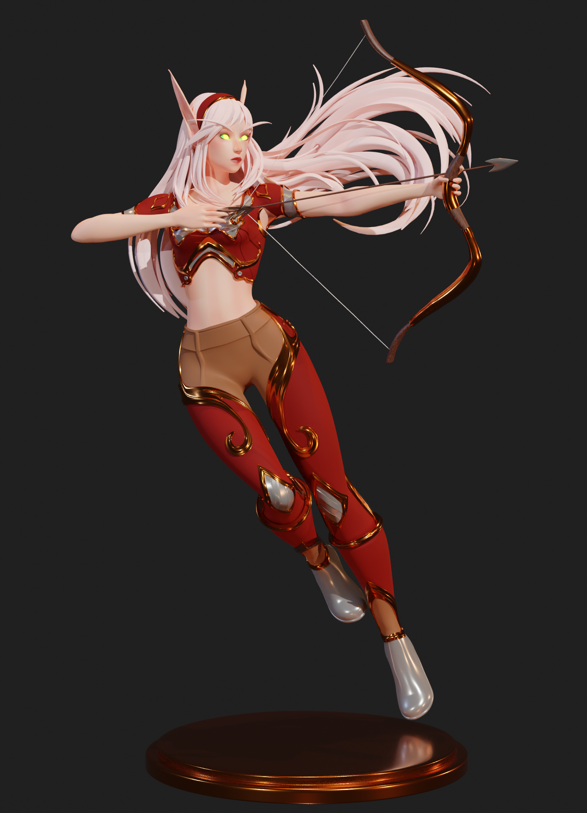

# 3d-Design
Personal projects I made using Blender.

Most of the .blend and .stl files could not be uploaded, but I provided images and demos.

## Projects
- [Azuremyst](Azuremyst)
- 
- [Collabetition](BillelisCollabetiton)
- 
- [Blood-Elf](BloodElf)
- 
- [Cold Snow](ColdSnow)
- 
- [Dinosaur Landscape](DinosaurLandscape)
- 
- [Durotan](Durotan)
- 
- [Fireboy and Watergirl](FireboyAndWatergirl)
- 
- [Jellyfish](Jellyfish)
- 
- [Profiles](Profiles)
- 
- 
- [Room Design](RoomDesign)
- 
- [Well Diorama](WellDiorama)
- 
- [Window project](Windowproject)
- 
- [Wise Monkeys](WiseMonkeys)
- 
- [Zodiac Scorpio](Zodiac_Scorpio)
- 
- [Split Sculpture](SplitSculpture)
- 

