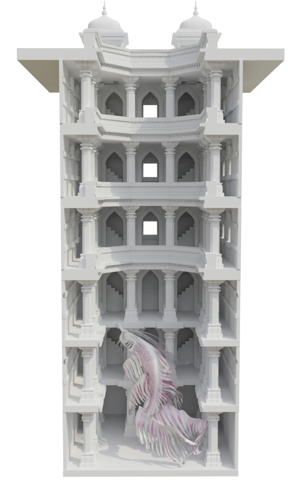

Areas of learning:
  - UV unwrapping
  - Map generation: normal, ambient occlusion and displacement map generation
  - Avoiding high-poly count by using linked duplicates and map generation
  - Texturing and shading: shading to give off an aged and organic look
  - Tree and foliage modeling
